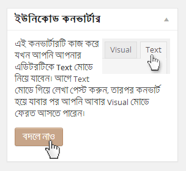

WP Bijoy to Unicode Converter Plugin
===========================================

A one-click ASCII Bangla (Bengali) to Unicode Bangla (Bengali) converter that can convert Bijoy (ASCII) Bangla (Bengali) texts into Unicode Bangla (Bengali). It can covert Bijoy ASCII texts into Unicode with a single click in WordPress post or page editor - in Text mode, and in Title field. The basic of the plugin was done by <a href="https://github.com/nishiafia">Ms. Tahmina Aktar</a>, based on the Javascripts of Online Unicode Converter by <a href="http://bnwebtools.sourceforge.net/">S. M. Mahbub Morshed</a>. Then it was verified, modified, simplified, and made translation-ready, and finally as a plugin by <a href="https://github.com/mayeenulislam">Mayeenul Islam</a> from <a href="http://nanodesignsbd.com">nanodesigns</a>.

###LICENSE###
    Copyright 2014 nanodesigns (email: info@nanodesignsbd.com)

    This program is free software: you can redistribute it and/or modify
    it under the terms of the GNU General Public License as published by
    the Free Software Foundation, either version 3 of the License, or
    any later version.

    This plugin is distributed in the hope that it will be useful,
    but WITHOUT ANY WARRANTY; without even the implied warranty of
    MERCHANTABILITY or FITNESS FOR A PARTICULAR PURPOSE. See the
    GNU General Public License for more details.

    You should have received a copy of the GNU General Public License
    along with this program. If not, see <http://www.gnu.org/licenses/>.

**NOTE**

The plugin is under GPL3 as S. M. Mahbub Morshed defined the direction of licensing
in his online converter as:

>বাংলা ওয়োবটুলসের লাইসেন্স
সেপ্টেম্বর ১৮, ২০০৭ (ভার্সন ২.১.০) থেকে এই প্রজেক্টটি দুটি	ভিন্ন ভিন্ন লাইসেন্সের অধীনে প্রকাশিত হচ্ছে।

>- যদি আপনি ব্যক্তিগত এবং অবানিজ্যিক ওপেন সোর্স প্রজেক্টে ব্যবহার করতে চান
  তাহলে এই সফটওয়্যারটি জিপিএল ৩ (<a href="http://www.gnu.org/licenses/gpl.html">GPL 3</a>) লাইসেন্সের অধীনে ব্যবহার করতে পারবেন।
- তবে বানিজ্যিকভাবে ব্যবহার করার জন্য আপনাকে অবশ্যই একটি অনুমোদিত
  এন্টারপ্রাইজ লাইসেন্স ক্রয় করতে হবে। লাইসেন্সের ব্যপারে বিস্তারিত জানতে যোগাযোগ করুন
  <a href="udvranto@yahoo.com">এস এম মাহবুব মুর্শেদের</a> সাথে।

###FUTURE FEATURES###
Thank you for using WordPress Bijoy to Unicode Converter. We are taking all the feature requests by
info@nanodesignsbd.com to improve the plugin for more successful performance on your WordPress
powered web platform. At present, we are thinking of many features what, we hope, can implement
into one of our future release:
   * Support into Custom Post Types (CPT)
   * Admin control page to make the ease to control the plugin as per your need
   * Support to Custom Fields (post meta data)

<big>"জয় হোক বাংলার... জয় হোক বাঙালির... জয় হোক বাংলাদেশের"</big>
